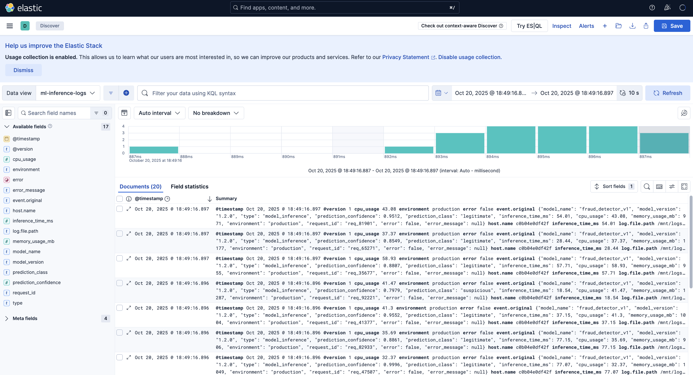

# ML Model Monitoring with ELK Stack

A real-time monitoring system for Machine Learning model inference logs using Elasticsearch, Logstash, and Kibana (ELK Stack).

## Overview

This project implements a file-based log monitoring system that tracks ML model inference metrics including:
- **Model Performance**: Prediction confidence and classification results
- **Inference Latency**: Response times in milliseconds
- **Resource Utilization**: CPU and memory usage
- **Error Tracking**: Failed predictions and error messages
- **Request Patterns**: Request IDs and environment tracking

### Key Features
- Real-time monitoring of ML model inferences
- File-based log collection and processing
- Interactive Kibana dashboards
- Dockerized ELK stack for easy deployment
- Continuous log generation for testing

## Architecture

```
┌──────────────────┐     ┌──────────────┐     ┌───────────────┐     ┌──────────────┐
│ Python Generator │────▶│ inference.log│────▶│   Logstash    │────▶│Elasticsearch │
│                  │     │    (File)    │     │ (File Input)  │     │              │
└──────────────────┘     └──────────────┘     └───────────────┘     └───────┬──────┘
                                                                              │
                                                                              ▼
                                                                      ┌──────────────┐
                                                                      │    Kibana    │
                                                                      │ (Dashboard)  │
                                                                      └──────────────┘
```

## Project Structure

```
Lab2_ELK_Setup_Mac/
├── docker-compose.yml              # Docker services configuration
├── README.md                       # This file
├── requirements.txt                # Python dependencies (if any)
├── .gitignore                      # Git ignore patterns
│
├── logstash_pipeline/
│   └── logstash.conf              # Logstash pipeline configuration
│
├── generate_inference_logs.py     # ML inference log generator
└── inference.log                  # Generated log file (created at runtime)
```

## Prerequisites

- **Docker Desktop** (macOS/Windows) or **Docker Engine + Docker Compose** (Linux)
  - macOS: [Download Docker Desktop](https://www.docker.com/products/docker-desktop)
- **Python 3.8+**
- **4GB+ RAM** available for Docker containers
- **5GB+ disk space** for containers and logs

### System Requirements
- CPU: 2+ cores recommended
- Memory: 8GB total (minimum 4GB for ELK Stack)
- Network: Ports 9200, 5601, 9600 available

## Installation

### 1. Clone or Navigate to Project Directory
```bash
cd /path/to/Lab2_ELK_Setup_Mac
```

### 2. Verify Project Structure
Ensure you have the following files:
- `docker-compose.yml`
- `logstash_pipeline/logstash.conf`
- `generate_inference_logs.py`

### 3. Start ELK Stack
```bash
# Start all services in detached mode
docker-compose up -d

# Verify all services are running
docker ps --format "table {{.Names}}\t{{.Status}}\t{{.Ports}}"

# Expected output: elasticsearch, kibana, logstash all running
```

### 4. Wait for Services to Initialize
```bash
# Wait 60-90 seconds for Elasticsearch and Kibana to fully start
sleep 60

# Check Elasticsearch health
curl -s "http://localhost:9200/_cluster/health?pretty"
```

### 5. Generate Inference Logs
```bash
# Start generating logs (runs continuously)
python3 generate_inference_logs.py
```

The script will:
- Create `inference.log` file in the current directory
- Generate realistic ML inference logs every 1-3 seconds
- Print logs to both file and console
- Continue until stopped with `Ctrl+C`

### 6. Access Kibana Dashboard
Open your browser and navigate to: **http://localhost:5601**

## Usage

### Starting the Lab

1. **Start Docker services:**
   ```bash
   docker-compose up -d
   ```

2. **Generate logs:**
   ```bash
   python3 generate_inference_logs.py
   ```

3. **Access Kibana:**
   - Open http://localhost:5601
   - Navigate to **Discover** to view raw logs
   - Create visualizations in **Dashboard**

### Stopping the Lab

1. **Stop log generator:**
   Press `Ctrl+C` in the terminal running the Python script

2. **Stop Docker services:**
   ```bash
   docker-compose down
   ```

3. **Remove data volumes (optional):**
   ```bash
   docker-compose down -v
   ```

## Configuring Kibana

### Creating Data View

1. Navigate to **Kibana** → **Stack Management** → **Data Views**
2. Click **Create data view**
3. Enter index pattern: `ml-inference-logs*`
4. Select timestamp field: `@timestamp`
5. Click **Create data view**

### Viewing Logs

1. Go to **Discover** in Kibana
2. Select `ml-inference-logs*` index pattern
3. Adjust time range to see recent logs
4. Add fields to display:
   - `model_name`
   - `prediction_confidence`
   - `inference_time_ms`
   - `cpu_usage`
   - `memory_usage_mb`
   - `error`

### Creating Visualizations

#### Example: Average Inference Time
1. Go to **Visualize** → **Create visualization**
2. Choose **Line** chart
3. Select `ml-inference-logs*` index
4. Metrics:
   - Y-axis: Average of `inference_time_ms`
5. Buckets:
   - X-axis: Date Histogram on `@timestamp`
6. Save visualization

#### Example: Error Rate
1. Create **Pie** chart
2. Metrics: Count
3. Buckets: Split slices by `error` field
4. Shows distribution of successful vs failed inferences

## Log Structure

Each generated log entry contains:

```json
{
  "model_name": "fraud_detector_v1",
  "model_version": "1.2.0",
  "type": "model_inference",
  "prediction_confidence": 0.9234,
  "prediction_class": "legitimate",
  "inference_time_ms": 45.67,
  "cpu_usage": 38.45,
  "memory_usage_mb": 1024,
  "environment": "production",
  "request_id": "req_12345",
  "error": false,
  "error_message": null
}
```

### Field Descriptions

| Field | Type | Description |
|-------|------|-------------|
| `model_name` | string | Name of the ML model |
| `model_version` | string | Version of the model |
| `type` | string | Log type (always "model_inference") |
| `prediction_confidence` | float | Confidence score (0.75-1.0) |
| `prediction_class` | string | "legitimate" or "suspicious" |
| `inference_time_ms` | float | Inference latency in milliseconds |
| `cpu_usage` | float | CPU usage percentage |
| `memory_usage_mb` | integer | Memory usage in MB |
| `environment` | string | Deployment environment |
| `request_id` | string | Unique request identifier |
| `error` | boolean | Whether an error occurred (5% rate) |
| `error_message` | string | Error details if error=true |

## Configuration

### Adjusting Log Generation Rate

Edit `generate_inference_logs.py`:

```python
# Change sleep duration (currently 1-3 seconds)
time.sleep(random.uniform(0.5, 1.5))  # Faster generation
```

### Modifying Model Behavior

Edit confidence ranges:
```python
confidence = random.uniform(0.60, 1.0)  # Lower minimum confidence
```

Change error rate:
```python
is_error = random.random() < 0.10  # 10% error rate
```

### Docker Resource Limits

Adjust memory allocation in `docker-compose.yml`:

```yaml
# Elasticsearch
- "ES_JAVA_OPTS=-Xms2g -Xmx2g"  # Increase to 2GB

# Logstash
- "LS_JAVA_OPTS=-Xms1g -Xmx1g"  # Increase to 1GB
```

## Troubleshooting

### No Data Appearing in Kibana

1. **Check log file is being created:**
   ```bash
   ls -lh inference.log
   tail -f inference.log
   ```

2. **Verify Logstash is reading the file:**
   ```bash
   docker-compose logs logstash | tail -20
   ```

3. **Check Elasticsearch has data:**
   ```bash
   curl -s "http://localhost:9200/ml-inference-logs/_count" | python3 -m json.tool
   ```

4. **Restart Logstash:**
   ```bash
   docker-compose restart logstash
   ```

### Port Already in Use

If ports 9200, 5601, or 9600 are in use:

```bash
# Check what's using the port
lsof -i :9200
lsof -i :5601

# Change ports in docker-compose.yml
ports:
  - "9201:9200"  # Use different host port
```

### Logstash Not Starting

1. **Check logs:**
   ```bash
   docker-compose logs logstash
   ```

2. **Verify configuration syntax:**
   ```bash
   docker exec -it logstash /usr/share/logstash/bin/logstash --config.test_and_exit -f /usr/share/logstash/pipeline/logstash.conf
   ```

3. **Restart with fresh config:**
   ```bash
   docker-compose down
   docker-compose up -d
   ```

### File Path Issues (macOS)

If Logstash can't find the log file, verify the volume mount path in `docker-compose.yml` matches your actual directory:

```yaml
volumes:
  - /Users/yourusername/path/to/Lab2_ELK_Setup_Mac:/mnt/logs
```

### Memory Issues

Reduce heap sizes if system runs out of memory:

```yaml
# In docker-compose.yml
- "ES_JAVA_OPTS=-Xms512m -Xmx512m"
- "LS_JAVA_OPTS=-Xms256m -Xmx256m"
```

## Useful Commands

### Docker Management
```bash
# View logs
docker-compose logs -f logstash
docker-compose logs -f elasticsearch

# Restart specific service
docker-compose restart logstash

# Stop all services
docker-compose down

# Remove volumes and data
docker-compose down -v
```

### Elasticsearch Queries
```bash
# Check cluster health
curl -s "http://localhost:9200/_cluster/health?pretty"

# View all indices
curl -s "http://localhost:9200/_cat/indices?v"

# Count documents in index
curl -s "http://localhost:9200/ml-inference-logs/_count?pretty"

# Search recent logs
curl -s "http://localhost:9200/ml-inference-logs/_search?pretty" -H 'Content-Type: application/json' -d'
{
  "size": 5,
  "sort": [{"@timestamp": "desc"}]
}'
```

### Log File Management
```bash
# Monitor logs in real-time
tail -f inference.log

# Clear log file
> inference.log

# Count log entries
wc -l inference.log
```

## Resources

- [Elasticsearch Documentation](https://www.elastic.co/guide/en/elasticsearch/reference/current/index.html)
- [Logstash Documentation](https://www.elastic.co/guide/en/logstash/current/index.html)
- [Kibana Documentation](https://www.elastic.co/guide/en/kibana/current/index.html)
- [Docker Compose Documentation](https://docs.docker.com/compose/)

### Dashboard Example

Once you've created visualizations, your dashboard might look like this:

